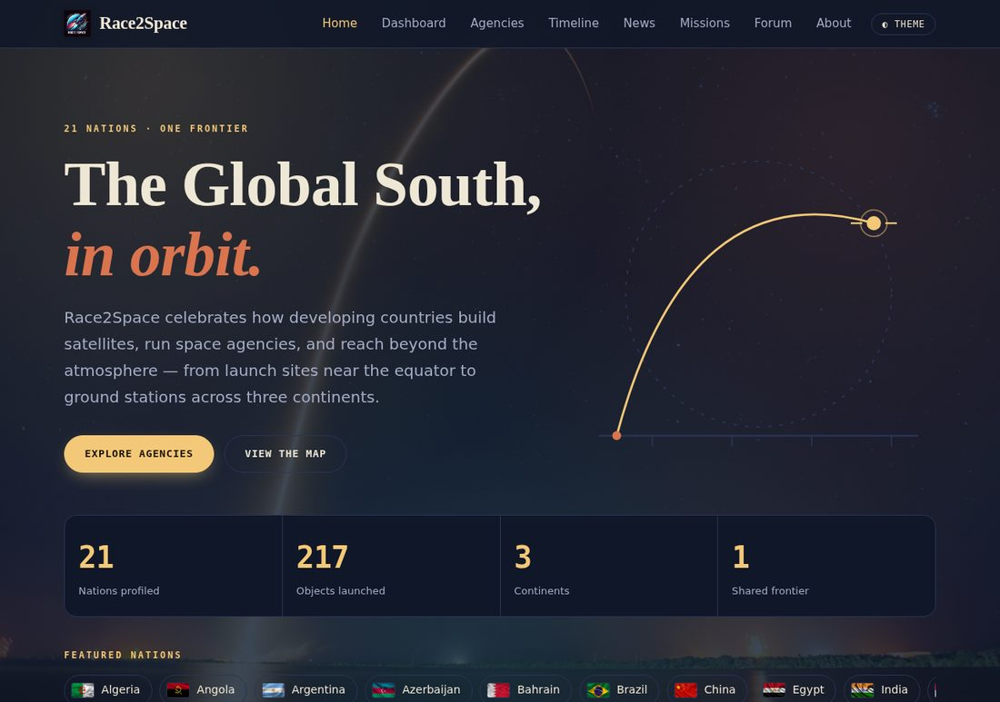
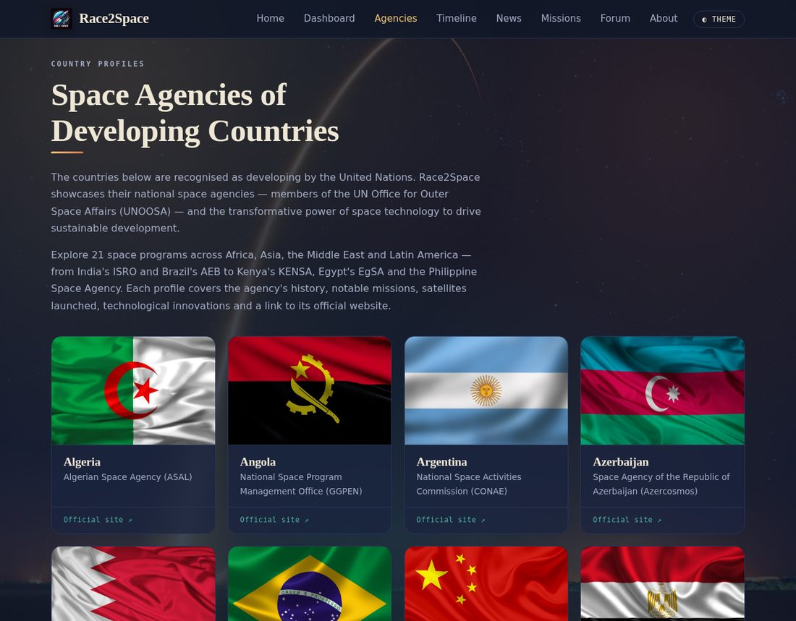
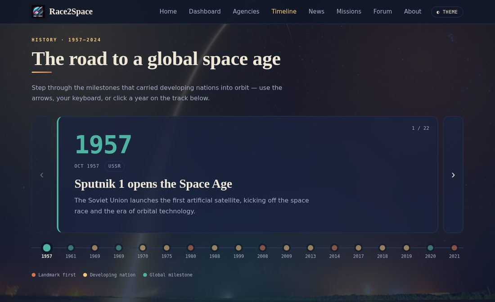
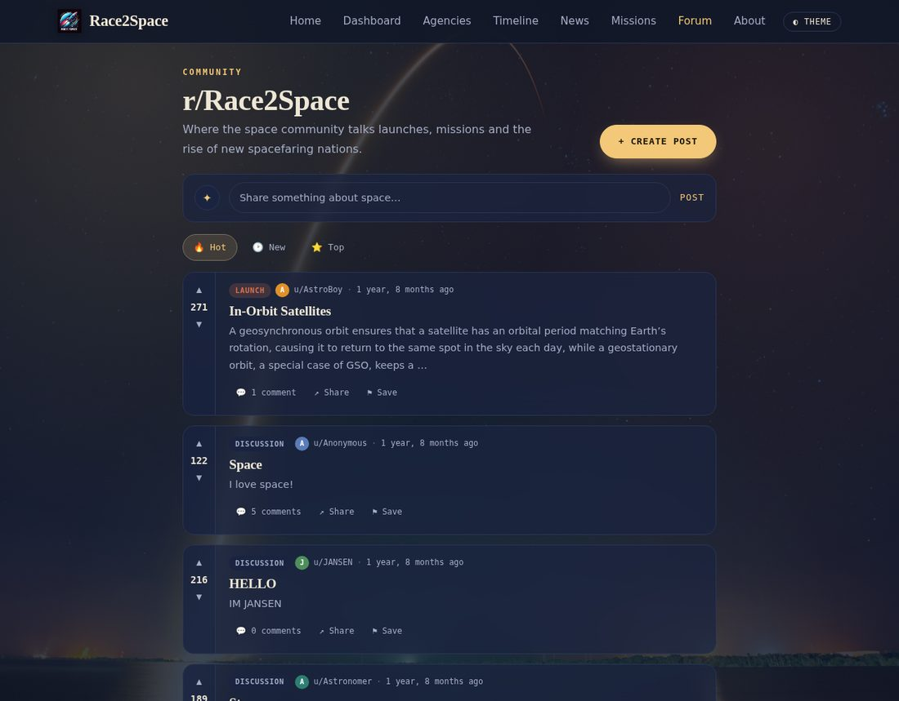
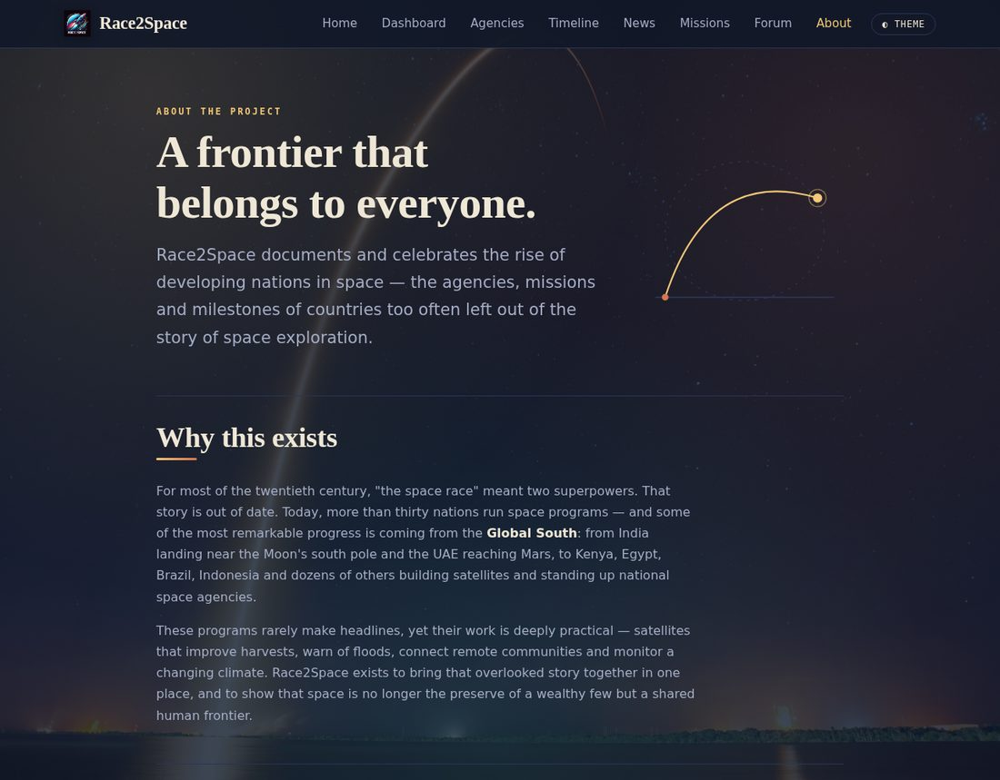
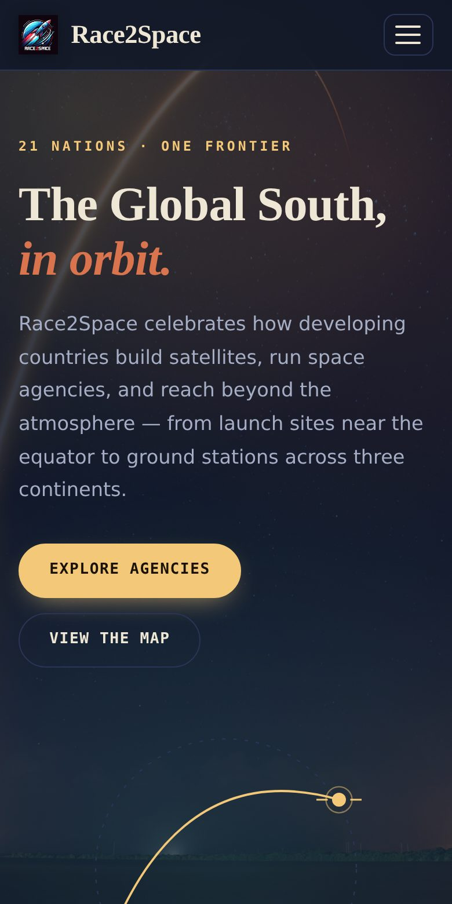

# 🛰️ Race2Space

**Tracking the rise of developing nations in space.**

Race2Space is a full-stack Django web platform that documents and celebrates the space programs of the Global South — the agencies, missions and milestones of countries too often left out of the story of space exploration. It combines **live orbital data**, **interactive visualizations** and original content into a single, cohesive product.

🔗 **Live site:** [race2space.pythonanywhere.com](https://race2space.pythonanywhere.com)



---

## ✨ Features

- 🛰️ **Live mission-control dashboard** — real-time tracking of the ISS, Tiangong and Hubble on a control-room map, a live launch schedule with countdowns, and a running "humans in space" count.
- 📊 **Interactive data visualization** — government space-budget comparisons across 34 agencies, filterable by region (Chart.js).
- 🌍 **Interactive world maps** — space agencies and live satellites, built with Leaflet.
- 🕹️ **Custom interactive timeline** — a hand-built journey through the milestones that carried developing nations into orbit.
- 📰 **Live newsroom** — a self-updating space-news feed.
- 💬 **Community forum** — a Reddit-style discussion board.
- 🎨 **Bespoke design system** — a fully custom, responsive UI with light/dark themes; no off-the-shelf template.
- 🔍 **Production-ready** — SEO (sitemap, structured data, Open Graph), secure settings, and continuous deployment.

---

## 🖼️ Screenshots

| Agency profiles | Interactive timeline |
| --- | --- |
|  |  |

| Community forum | About |
| --- | --- |
|  |  |

<p align="center">
  
  <br><em>Fully responsive — from 320px phones to widescreen monitors.</em>
</p>

---

## 🛠️ Tech stack

| Layer | Technologies |
| --- | --- |
| **Backend** | Python, Django |
| **Frontend** | JavaScript (vanilla), HTML, CSS, Chart.js, Leaflet |
| **Database** | SQLite |
| **Live data** | [Spaceflight News API](https://spaceflightnewsapi.net/), [The Space Devs — Launch Library 2](https://thespacedevs.com/), [WhereTheISS.at](https://wheretheiss.at/) |
| **Deployment** | PythonAnywhere |

All live data is fetched **client-side**, so the app works without any server-side outbound access.

---

## 🚀 Running locally

```bash
# 1. Clone
git clone https://github.com/jhb09808/Race2Space.git
cd Race2Space

# 2. Create a virtual environment
python -m venv venv
source venv/bin/activate        # Windows: venv\Scripts\activate

# 3. Install dependencies
pip install -r requirements.txt

# 4. Apply migrations
python manage.py migrate

# 5. Run
python manage.py runserver
```

Then open <http://127.0.0.1:8000>.

> For local development, enable debug mode: set the environment variable `DJANGO_DEBUG=True`.
> In production, `DEBUG` defaults to `False` and the secret key is read from `DJANGO_SECRET_KEY`.

---

## 📁 Project structure

```
race2space/          # Django project settings & root URLs
home/                # Main app
├── models.py        # AgencyProfile, Discussion, NewsArticle, Mission, ...
├── views.py         # Page views, sitemap, robots.txt
├── space_data.py    # Curated world-agency dataset & history timeline
├── templates/home/  # All page templates + the design system (base.html)
└── static/ , media/ # Logo, backgrounds, country flags
```

---

## 📊 About the data

Data is compiled from public sources — the UN Office for Outer Space Affairs (UNOOSA), national space-agency publications, and open data feeds for live launches and orbital tracking. Budget figures are indicative annual estimates, not audited accounts, and some (such as China's) are best-available approximations.

---

## 👤 Author

**Jerome Bustarga** — [jeromebustarga.com](https://jeromebustarga.com)

Built as an independent project exploring full-stack development, live data integration and data visualization. Licensed under the MIT License.
